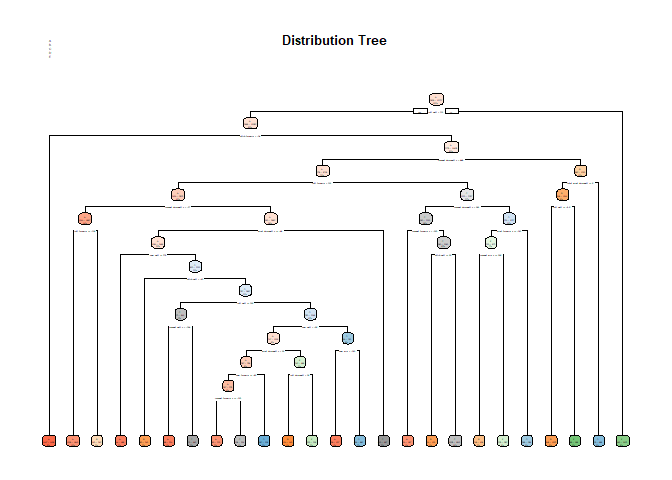
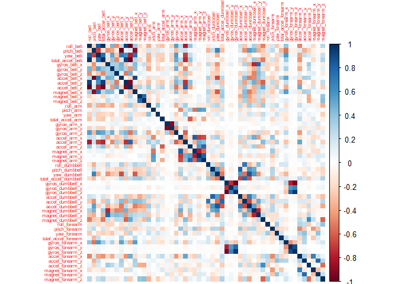

## Project Introduction

This project looks at how fitness data about personal activitity collected from electronic devices can be analyzed using Machine learning techniques. Datasets wete obtained from a group of enthusiasts who take regular records of their activities for varying reasons. While most people regularly measure how much of a specific activity they do, how well these activities are carried are barely measured. The aim of this project is to distinguish between correctly done exercises and theie incorrect versions using data from http://groupware.les.inf.puc-rio.br/har (see the section on the Weight Lifting Exercise Dataset). There are six participants and five activities to be tested. Original dataset is divided into train and test data. The aim is to create a model that predicts the manner in which the ecercise or activities are carried out using the "classe" variable in the train set.


```r
## load the appropriate libraries and set seed 
library(caret)
library(rpart);library(rpart.plot)
library(RColorBrewer)
library(rattle)
library(e1071)
library(randomForest)
library(corrplot)
set.seed(123)
```

## Download data

the code below downloads the data and assign them into r objects which are then explored. Both data have 160 variables however the train data has 19622 observations while the test data is limited to 20 observations.

```r
trainUrl <- "https://d396qusza40orc.cloudfront.net/predmachlearn/pml-training.csv"
testUrl <- "https://d396qusza40orc.cloudfront.net/predmachlearn/pml-testing.csv"

trainData <- "./MLProj/trainData.csv"
testData <- "./MLProj/testData.csv"

if (!file.exists("./MLProj")) {
  dir.create("./MLProj")
}
if (!file.exists(trainData)) {
  download.file(trainUrl, destfile=trainData, method="curl")
}
if (!file.exists(testData)) {
  download.file(testUrl, destfile=testData, method="curl")
}
##download.file(trainUrl, destfile = "./trainData.csv", method = "curl")
##download.file(testUrl, destfile = "./testData.csv", method = "curl")

## load raw data

trainData <- read.csv("./MLProj/trainData.csv", na.strings = c("NA", "#DIV/0!", "")) ## identify NAs within datasets
testData <- read.csv("./MLProj/testData.csv", na.strings = c("NA", "#DIV/0!", ""))   ## identify NAs within datasets

## explore loaded data
head(trainData,3)
head(testData,3)
```

## Data Cleaning
Irrelevant variables are removed and columns with NAs as well. Also column with near zero variations were checked for however there are none in the dataset. The refined datasets have 53 variables.

```r
##remove irrelevant columns
trainDataRef <- trainData[, 8:length(trainData)]
testdataRef <- testData[, 8:length(testData)]

##remove columns with NAs
trainDataRef <- trainDataRef[colSums(is.na(trainDataRef)) == 0]
testdataRef <- testdataRef[colSums(is.na(testdataRef)) == 0]

## identify records with near zero variance and remove them
NZV <- nearZeroVar(trainDataRef, saveMetrics = TRUE)
trainDataRef <- trainDataRef[,NZV$nzv==FALSE]
```

## (Train)Data Partition
the train data set is partitioned into a train set and a validation set

```r
## Train data partition necessary for cross validation
set.seed(1234)
in.training <- createDataPartition(trainDataRef$classe, p = 0.70, list = F)
trainData1 <- trainDataRef[in.training,]
validationData <- trainDataRef[-in.training,]
```

## Initialized Exploration Plots
<!-- --><!-- -->

## Modeling of the Train Data
A predictive model using the random forrest algorithm for activity recognition is used to model the data. A 5 fold cross validation scheme is utilized in the process.

```r
##Model generation
rfModel <- train(classe ~ ., data = trainData1, method = "rf", trControl = trainControl(method = "cv", 5), ntree = 250)
rfModel
```

```
## Random Forest 
## 
## 13737 samples
##    52 predictor
##     5 classes: 'A', 'B', 'C', 'D', 'E' 
## 
## No pre-processing
## Resampling: Cross-Validated (5 fold) 
## Summary of sample sizes: 10989, 10990, 10989, 10990, 10990 
## Resampling results across tuning parameters:
## 
##   mtry  Accuracy   Kappa    
##    2    0.9914827  0.9892247
##   27    0.9908275  0.9883956
##   52    0.9843484  0.9801989
## 
## Accuracy was used to select the optimal model using the largest value.
## The final value used for the model was mtry = 2.
```


```r
##test model with validation dataset
rfPredict <- predict(rfModel, validationData)
confusionMatrix(table(validationData$classe, rfPredict))
```

```
## Confusion Matrix and Statistics
## 
##    rfPredict
##        A    B    C    D    E
##   A 1674    0    0    0    0
##   B    2 1134    3    0    0
##   C    0   12 1014    0    0
##   D    0    0   15  948    1
##   E    0    0    0    0 1082
## 
## Overall Statistics
##                                           
##                Accuracy : 0.9944          
##                  95% CI : (0.9921, 0.9961)
##     No Information Rate : 0.2848          
##     P-Value [Acc > NIR] : < 2.2e-16       
##                                           
##                   Kappa : 0.9929          
##                                           
##  Mcnemar's Test P-Value : NA              
## 
## Statistics by Class:
## 
##                      Class: A Class: B Class: C Class: D Class: E
## Sensitivity            0.9988   0.9895   0.9826   1.0000   0.9991
## Specificity            1.0000   0.9989   0.9975   0.9968   1.0000
## Pos Pred Value         1.0000   0.9956   0.9883   0.9834   1.0000
## Neg Pred Value         0.9995   0.9975   0.9963   1.0000   0.9998
## Prevalence             0.2848   0.1947   0.1754   0.1611   0.1840
## Detection Rate         0.2845   0.1927   0.1723   0.1611   0.1839
## Detection Prevalence   0.2845   0.1935   0.1743   0.1638   0.1839
## Balanced Accuracy      0.9994   0.9942   0.9900   0.9984   0.9995
```


```r
modelAccuracy <- as.numeric(confusionMatrix(table(validationData$classe, rfPredict))$overall[1])
modelAccuracy
```

```
## [1] 0.9943925
```

```r
OSE <- 1 - modelAccuracy
OSE
```

```
## [1] 0.005607477
```

```r
##OSE1 <- 1 - as.numeric(confusionMatrix(table(validationData$classe, rfPredict))$overall[1])
```
The estimated accuracy of the model is 0.9943925 and the estimated out of sample error is 0.0056075.

## Test Data Prediction

The model is now applied to the test data however the last variable in the dataset is excluded from the analysis.

```r
##Results
testResults <- predict(rfModel, testdataRef[, -length(testdataRef)])
testResults
```

```
##  [1] B A B A A E D B A A B C B A E E A B B B
## Levels: A B C D E
```


